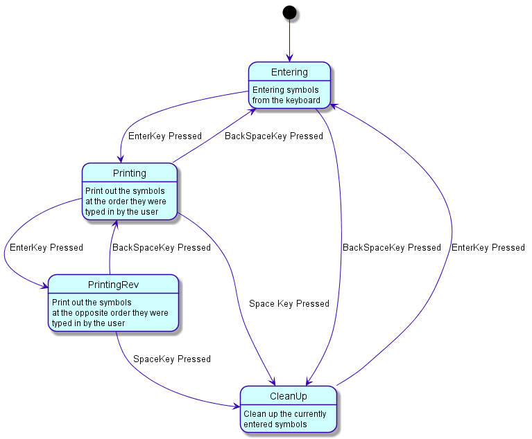

# Hilscher DTC Technical Task

## Task Description
Implement the followin state diagram in C.




## Pre-requisites

- GCC compiler
- Windows 7 or later

## How to run the code

### Select one of the following options:

1. Uncomment FSM_A or FSM_B in the main.c file to run the respective state machine.
2. Uncomment the TEST macro in the main.c file to run the test cases.
3. Run the following command in the terminal:

```bash
$ gcc -o main main.c
$ ./main
```

## How to build the documentation
```bash
$ doxygen Hilscher_Doxyfile
```
